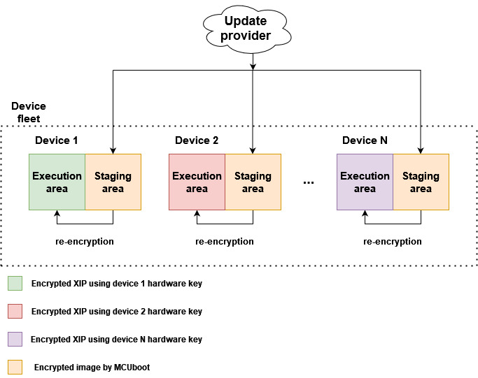
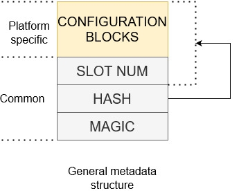

# MCUBoot and encrypted XIP on NXP MCUs

- [1. Introduction](#1-introduction)
- [2. MCUBoot encrypted image](#2-mcuboot-encrypted-image)
- [3. Encrypted XIP extension for MCUboot](#3-encrypted-xip-extension-for-mcuboot)
   * [3.1 Three slot configuration](#31-three-slot-configuration)
   * [3.2 Overwrite-only mode](#32-overwrite-only-mode)
   * [3.3 Summary of extension modes](#33-summary-of-extension-modes)
- [4. NXP encryption engines](#4-nxp-encryption-engines)
   * [4.1 BEE (Bus Encryption Engine)](#41-bee-bus-encryption-engine)
   * [4.2 OTFAD (On-the-Fly AES Decryption Module)](#42-otfad-on-the-fly-aes-decryption-module)
   * [4.3 IPED (Inline Prince Encryption/Decryption)](#43-iped-inline-prince-encryptiondecryption)
- [5. OTA examples instructions](#5-ota-examples-instructions)
   * [5.1 Enable encrypted XIP support and build projects](#51-enable-encrypted-xip-support-and-build-projects)
   * [5.2 Generate RSA key pairs for encrypted image containers](#52-generate-rsa-key-pairs-for-encrypted-image-containers)
   * [5.3 Sign and encrypt image](#53-sign-and-encrypt-image)
   * [5.4 Evaluate encrypted XIP example](#54-evaluate-encrypted-xip-example)
      + [5.4.1 Load encrypted image container to flash memory](#541-load-encrypted-image-container-to-flash-memory)
      + [5.4.2 Run unsigned unencrypted OTA application (debug session)](#542-run-unsigned-unencrypted-ota-application-debug-session)
   * [5.5 Running encrypted image](#55-running-encrypted-image)
- [6. Advanced topics](#6-advanced-topics)
   * [6.1 Chain of Trust](#61-chain-of-trust)

## 1. Introduction

To provide confidentiality of image data while in transport to the device or while residing on an non-secure storage such as external flash memory, MCUboot has support for encrypting/decrypting images on-the-fly while upgrading. Design expects that MCUboot selects and authenticates encrypted image and decrypts the image to a secure execution location such as internal flash or RAM. 

NXP i\.MX RT series supports encrypted XIP on an external flash device directly with on-the-fly decryption feature powered by device decryption engine (BEE, OTFAD, IPED...).
At the moment MCUBoot officially doesn't support encrypted XIP on an external flash. This document describes extension of MCUBoot functionality to support encrypted XIP using these decryption engines in NXP devices.

## 2. MCUBoot encrypted image

For more information please see [MCUBoot Encrypted images documentation](https://docs.mcuboot.com/encrypted_images.html). 

An image payload is encrypted using AES-CTR cipher by image tool (see [imgtool](https://docs.mcuboot.com/imgtool.html)). The AES key is randomized per OTA image creation and padded to image as encrypted section using asymmetric encryption. This encrypted AES key can be decrypted using private key in selected key encryption scheme (RSA-OAEP, AES-KW, ECIES-P256 or ECIES-X25519).

Following image shows keys management of MCUboot encrypted image.

Current version of MCUboot (2.0.0) doesn't support hardware format of private key using trusted sources (OTP, TPM...) and currently supports only private key embed in MCUboot code (see `keys.c` source file). User is advised to implement secure provisioning and loading of the private key in device, for example by encrypting bootloader application or staging private key in encrypted secure area. For more information please see chapter `8. Advanced topics`.

Support of hardware keys for encrypted images is targeted for next release of MCUboot.

## 3. Encrypted XIP extension for MCUboot

The extension combines usage of platform specific decryption engine and funcionality of MCUBoot encrypted images created by [imgtool](https://docs.mcuboot.com/imgtool.html). 

Following image shows simplified OTA update flow of device fleet using encrypted XIP extension.

Device fleet shares private key used for decryption of encrypted OTA images residing on staging areas. The AES key is then used for image re-encryption to the execution area. The execution area implements target platform specific de/encryption for encrypted XIP using device specific hardware key. Is up to user if the hardware key is unique per device instance or it is same across the device fleet.

Due complexity and different handling of encryption engines used across NXP devices and to support revert mechanism (image self-test) and unique nonce per OTA update, the encrypted XIP extension is implemented in so called **three slot configuration**. If revert mechanism is not needed the **overwrite-only mode** can be used alternatively.

MCUBoot determines the boot state by inspecting the image trailers (mcuboot metadata) which have reserved area at the end of each slot. The ecrypted XIP extension uses reserved area called **encryption metadata** which is platform specific and used for particular target encryption handling. Following image shows general structure of encryption metadata.

The slot number is pointer to slot containing selected image extracted from MCUBoot response object. Hash secures integrity of slot number and configuration blocks.

Note: the placement of metadata is up to user. In the case of three mode configuration the metadata can be stored at the end of the execution slot instead of original sector with MCUboot trailer because the trailer is not used in execution area.

### 3.1 Three slot configuration

Following image shows flash memory layout using MCUboot bootloader in DIRECT-XIP mode and encrypted XIP extension using three slot configuration.

Primary and secondary slots act as staging area for encrypted OTA images and execution slot is used as execution area of encrypted image using platform on-the-fly decryption. The execution slot is platform specific and its implementation depends on target decryption engine. The encrypted XIP is emulated by execution of working copy of authentized image by MCUboot.

For this purpose [DIRECT-XIP](https://docs.mcuboot.com/design.html#direct-xip) mode is used for staging downloaded encrypted OTA images which is fully handled by MCUBoot. Authentized and selected image (flagged as active) by MCUBoot is then re-encrypted to the execution slot (if needed) which is handled by post-bootloader process. The whole post-bootloader process is out of context of MCUboot and it is basically plugged just before jumping the selected image by MCUboot. The process is handled in module `mcuboot_enc_support.c`.

The re-encryption is only done for new image selection otherwise the content of execution slot is validated for integrity against reference image in staging area. In summary the whole solution separates MCUBoot code and integration of encrypted XIP support. 
Following image demonstrate simplified flow of MCUBoot boot process and encrypted XIP initialization.

### 3.2 Overwrite-only mode

This mode is much simpler but lacks revert functionality so installed image can't proceed self-test.

Following image shows simplified flow of MCUBoot overwrite-only mode extended with encrypted XIP extension.

Before jumping to booting process the on-the-fly decryption is initialiazed so MCUboot is able to read and validate content in primary slot. Re-encryption process is implemented in flash backend and MCUboot hooks (see `flash_api.c` and `bootutil_hooks.c`).

### 3.3 Summary of extension modes

Both configurations are summarized in following table

| **Extension mode** | **flash size**     | **rollback support** |
|--------------------|--------------------|------------------------------|
| **Three slot**     | 3 x slot size      | yes                          |
| **Overwrite-only** | 2 x slot size      | no                           |

## 4. NXP encryption engines

### 4.1 BEE (Bus Encryption Engine)

This peripheral is specific for RT10xx (except RT1010) and supports up two separate regions using two separate AES keys. In this solution, BEE region 1 is used for encrypting execution slot and BEE region 0 is reserved for bootloader if needed.

The BEE controller is automatically configured by ROM when specific encryption configuration blocks are found at the start of flash memory. The encryption configuration blocks are organized as __EPRDB__ (Encrypted Protection Region Descriptor BLock), the __EPRDB__ is encrypted using AES-CBC mode with AES key and IV in __KIB__ (Key Info Block). The __KIB__ is encrypted as __EKIB__ (Encrypted KIB) using key provisioned by user. Each BEE region has its __PRDB/KIB pair__. Updating the content of those encryption configuration blocks per OTA update (due new nonce etc) affects other configuration blocks such as Flash Configuration block, IVT etc located at the start of flash memory due typical size of erase sector of target flash device. 

For this reason these configuration blocks are moved to encryption metadata and the controller of BEE region 1 is configured using the metadata before accessing content in execution area.

Following image shows configuration of metadata structure used for devices with BEE.

The EKIB is decrypted by a key based on selection in `BEE_KEYn_SEL` fuse:

* __Software key__
	* default value in `BEE_KEYn_SEL`
	* evaluating BEE without fusing the device
* __SW-GP2__
	* fused by user
	* limited funcionality due hw bugs (`SW_GP2_LOCK` fuse, HAB Open state...), see errata
	* not supported in this solution, reserved for offline encryption
* __OTPMK__
	* provisioned by NXP in factory
	* unique per device instance, prevent image cloning
	* __recommended__

Firmware in execution slot is de/encrypted using AES-CTR combining nonce extracted from PRDB and this device key. The extension automatically detects device key by evaluating `BEE_KEYn_SEL` fuse.

The whole BEE initialization and encryption metadata handling is resolved in module `platform_enc_bee.c`.

Additional information can be found in Security Reference Manual of target device and in AN12800, AN12852 and AN12901.

### 4.2 OTFAD (On-the-Fly AES Decryption Module)

To be implemented...

### 4.3 IPED (Inline Prince Encryption/Decryption)

To be implemented...

## 5. OTA examples instructions

Start preferentially with an empty board, erasing original content if needed.

### 5.1 Enable encrypted XIP support and build projects

Encrypted XIP can be evaluated by enabling define `CONFIG_ENCRYPT_XIP_EXT_ENABLE` in `sblconfig.h`.

Optional overwrite-only mode is enabled by `CONFIG_ENCRYPT_XIP_EXT_OVERWRITE_ONLY`.

Note: make sure that define `CONFIG_MCUBOOT_FLASH_REMAP_ENABLE` is disabled otherwise builds fails.

Build mcuboot_opensource and OTA application.

Load mcuboot_opensource.

### 5.2 Generate RSA key pairs for encrypted image containers

This part can be skipped as OTA examples uses pre-generated key pairs.

Generate private key
~~~
imgtool keygen -k enc-rsa2048-priv.pem -t rsa-2048
~~~
Adjust the content of the `middleware\mcuboot_opensource\boot\nxp_mcux_sdk\keys\enc-rsa2048-priv.pem` accordingly.

Extract private key to C-array
~~~
imgtool getpriv --minimal -k enc-rsa2048-priv.pem
~~~
Adjust the content of the `middleware\mcuboot_opensource\boot\nxp_mcux_sdk\keys\enc-rsa2048-priv-minimal.c` accordingly.

Derive public key key
~~~
imgtool getpub -k enc-rsa2048-pub.pem -e pem
~~~
Adjust the content of the `middleware\mcuboot_opensource\boot\nxp_mcux_sdk\keys\enc-rsa2048-pub.pem` accordingly.

### 5.3 Sign and encrypt image

To sign and encrypt an application binary, imgtool must be provided with respective key pairs and a set of parameters as in the following example:

~~~
 imgtool sign --key sign-rsa2048-priv.pem
	      --align 4
	      --header-size 0x400
	      --pad-header
	      --slot-size 0x200000
	      --max-sectors 800
	      --version "1.0"
	      -E enc-rsa2048-pub.pem
	      app_binary.bin
	      app_binary_SIGNED_ENCRYPTED.bin
~~~

In case an image loaded directly to flash memory, the parameters `--pad --confirm` needs to be added.

### 5.4 Evaluate encrypted XIP example

There are two methods how to run "first" image.

#### 5.4.1 Load encrypted image container to flash memory

Look into `flash_partitioning.h`

For three slot configuration you will find:

~~~
/* Encrypted XIP extension: Three slot mode */

#define BOOT_FLASH_EXEC_APP             0x60040000  -- execution slot address
#define BOOT_FLASH_ACT_APP              0x60240000  -- primary staging slot address
#define BOOT_FLASH_CAND_APP             0x60440000  -- secondary staging slot address
#define BOOT_FLASH_ENC_META             0x60640000  -- encryption metadata address
~~~

Image generated with additional `--pad --confirm` can be loaded to primary or secondary slot.

For overwrite-only configuration you will find:

~~~
/* Encrypted XIP extension: modified overwrite-only mode */

#define BOOT_FLASH_ACT_APP              0x60040000  -- active slot address
#define BOOT_FLASH_CAND_APP             0x60240000  -- candidate slot address
#define BOOT_FLASH_ENC_META             0x60440000  -- encryption metada address
#define BOOT_FLASH_EXEC_APP             BOOT_FLASH_ACT_APP
~~~

Image has to be loaded to candidate slot address. Additional `--pad --confirm` parameters are not needed.

If supported by probe the pyocd tool can be used following this command:
~~~
pyocd flash app_binary_SIGNED_ENCRYPTED_PADDED.bin -a 0x60240000 -t MIMXRT1060
pyocd reset
~~~
Pyocd support can be checked by:
~~~
pyocd list
~~~

#### 5.4.2 Run unsigned unencrypted OTA application (debug session)

An application can be loaded and run by debug session. When performing an OTA update the application responses with warning:
~~~
WARNING: invalid metadata of execution slot - debug session?
WARNING: OTA image will be downloaded to secondary slot
~~~
This is expected as there is no encryption metadata so application has no reference to linking active application in staging area.

### 5.5 Running encrypted image

These are expected outputs when new image is detected and then re-encrypted

Three slot configuration:
~~~
hello sbl.
Bootloader Version 2.0.0
Primary   slot: version=1.0.0+0
Image 0 Secondary slot: Image not found
writing copy_done; fa_id=0 off=0x1fffe0 (0x43ffe0)
Image 0 loaded from the primary slot

Starting post-bootloader process of encrypted image...
Referenced image is located in the primary slot
Decrypting and loading MCUBOOT AES-CTR key for staged image...
AES-CTR key loaded
Checking execution slot...
No valid image found in staging area...
Preparing execution slot for new image
Installing new image into execution slot from staged area
On-the-fly initialization completed
Re-encrypting staged image in execution slot...
........................................................................
Loading image successful
Image verification successful
Post-bootloader process of encrypted image successful

Bootloader chainload address offset: 0x40000
Reset_Handler address offset: 0x40400
Jumping to the image

OTA HTTPS client demo (Ethernet)

Initializing PHY...
Obtaining IP address from DHCP...
~~~

Overwrite-only mode:
~~~
hello sbl.
Bootloader Version 2.0.0
On-the-fly decryption initialization completed
Image index: 0, Swap type: test
Image 0 upgrade secondary slot -> primary slot
Erasing the primary slot
On-the-fly decryption initialization completed
Image 0 copying the secondary slot to the primary slot: 0x7415 bytes
writing magic; fa_id=0 off=0x1ffff0 (0x23fff0)
erasing secondary header
erasing secondary trailer
Bootloader chainload address offset: 0x40000
Reset_Handler address offset: 0x40400
Jumping to the image

OTA HTTPS client demo (Ethernet)

Initializing PHY...
Obtaining IP address from DHCP...
~~~

## 6. Advanced topics

### 6.1 Chain of Trust

To complete Chain of Trust the bootloader image has to be authentized by device ROM as well. i.MX RT10xx (RT11xx) crossover MCUs integrate secure features for this purpose - specifically High Assurance Boot (HAB) functionality. The bootloader encryption is optional but recommended due current state of hardware key support for encrypted image in MCUboot (2.0.0).

In order to enable HAB, the [SEC tool](https://www.nxp.com/design/software/development-software/mcuxpresso-software-and-tools-/mcuxpresso-secure-provisioning-tool:MCUXPRESSO-SECURE-PROVISIONING) has to be used. A walkthrough of the HAB enabling process can be found [here](https://www.nxp.com/design/training/secure-boot-on-the-i-mx-rt10xx-crossover-mcus:TIP-SECURE-BOOT-ON-THE-I.MX-RT10XX-CROSSOVER-MCUS?SAMLart=ST-AAF0E3YJDJej%2BJVBprc7Vu5rkUdez2IREF5agwakysTZKo6kjKUWEzSa).

Additional information can be found in AN12079, AN12681 and AN13250.