# Table of content

- [Table of content](#table-of-content)
- [Overview](#overview)
- [Configure and Build NXP Zigbee examples with VS Code and CMake Tools extension](#configure-and-build-nxp-zigbee-examples-with-vs-code-and-cmake-tools-extension)
  - [Prerequisites](#prerequisites)
  - [Configure and Build](#configure-and-build)
- [Debug with VS Code](#debug-with-vs-code)
  - [Prerequisites](#prerequisites-1)
  - [Find your J-Link probes](#find-your-j-link-probes)
    - [What's under the hood](#whats-under-the-hood)
  - [Debug](#debug)
    - [What's under the hood](#whats-under-the-hood-1)

# Overview

NXP Zigbee repository provides in the `.vscode` folder several settings, scripts, tasks and launch configuration to allow
any VS Code user to configure, build and debug any CMake-based example. All the tools provided are not NXP specific and
only rely on several extensions published on VS Code Marketplace.

The file `.vscode/extensions.json` provides the list of recommended extensions to be used with NXP Zigbee examples, we highly
recommended installing them in your workspace.

Here are some details on some of those extensions:
- [`ms-vscode.cpptools`](https://marketplace.visualstudio.com/items?itemName=ms-vscode.cpptools): this extension adds support for C/C++ to VS Code
- [`ms-vscode.cmake-tools`](https://marketplace.visualstudio.com/items?itemName=ms-vscode.cmake-tools): this extension adds support for CMake to VS Code, it allows to easily configure and build CMake-based projects
- [`ms-vscode.vscode-embedded-tools`](https://marketplace.visualstudio.com/items?itemName=ms-vscode.vscode-embedded-tools): this extension provides a register view for CMSIS-SVD files and an RTOS data viewer
- [`ms-vscode.vscode-serial-monitor`](https://marketplace.visualstudio.com/items?itemName=ms-vscode.vscode-serial-monitor): this extension provides a serial interface to be able to interact with serial ports
- [`marus25.cortex-debug`](https://marketplace.visualstudio.com/items?itemName=marus25.cortex-debug): this extension adds debugging support for ARM Cortex-M microcontrollers
- [`mcu-debug.memory-view`](https://marketplace.visualstudio.com/items?itemName=mcu-debug.memory-view): this extension provides a memory viewer built to work with several debugger extensions, such as `cortex-debug`
- [`mcu-debug.rtos-views`](https://marketplace.visualstudio.com/items?itemName=mcu-debug.rtos-views): this extension provides an RTOS data viewer built to work with `cortex-debug`
- [`rioj7.command-variable`](https://marketplace.visualstudio.com/items?itemName=rioj7.command-variable): this extension several tools to generate and handle variables in `tasks.json` and `launch.json`. This is used by NXP to parse custom json files which provide metadata on NXP devices. This allows to provide tasks and launch configuration that are generic to the user setup.

# Configure and Build NXP Zigbee examples with VS Code and CMake Tools extension

NXP CMake-based Zigbee examples can be configured and built using [CMakePresets](https://cmake.org/cmake/help/latest/manual/cmake-presets.7.html).
This feature is supported by the CMake Tools extension for VS Code, so the user can configure and build any example through VS Code GUI, instead of using
cmake command line.

## Prerequisites

All prerequisites from the main [README.md](../../README.md) apply here, so be sure to comply with them first.

Also, make sure to install [`ms-vscode.cmake-tools`](https://marketplace.visualstudio.com/items?itemName=ms-vscode.cmake-tools)
extension in your VS Code installation and make sure to follow the official documentation to set it up correctly.
We recommend adding `cmake` and `ninja` to your PATH environment variable, so the extension can invoke them without any issue.

Once installed, the CMake Tools extension can be interacted with from the Activity Bar, as an example:

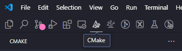

## Configure and Build

When opening the CMake Tools interface in VS Code, it will look similarly to the following:

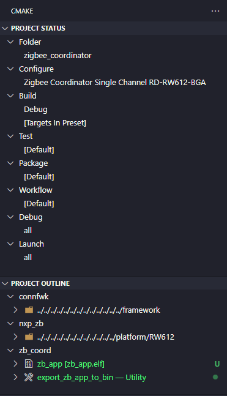

The first step consists of selecting the source folder of the project you want build:

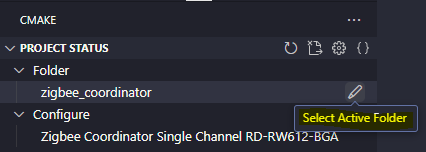

By clicking on `Select Active Folder`, you will be able to select supported projects:

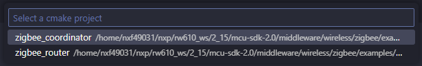

Once the project is selected, you can choose between several configuration presets. Those presets are defined by NXP
to showcase various configuration of the same example:

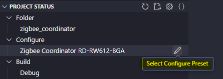

By clicking on `Select Configure Preset`, you will be able to select from various presets for the selected example:

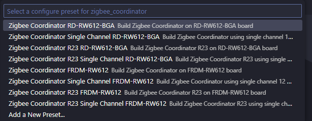

You can then click on the `Build` button to build the example with the selected configuration:

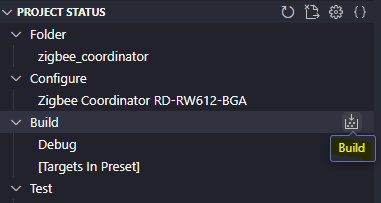

# Debug with VS Code

NXP Zigbee examples can be debugged on supported target directly within VS Code, thanks to the `tasks.json` and `launch.json`
provided in the `.vscode` folder. Those files are relying mainly on two extensions:
- [`marus25.cortex-debug`](https://marketplace.visualstudio.com/items?itemName=marus25.cortex-debug)
- [`rioj7.command-variable`](https://marketplace.visualstudio.com/items?itemName=rioj7.command-variable)

## Prerequisites

All prerequisites from the main [README.md](../../README.md) apply here, so be sure to comply with them first.

Also, make sure to install `cortex-debug` and `command-variable` extensions, otherwise the following instructions won't work.
We recommend adding your J-Link installation folder to your PATH environment variable, so Cortex-Debug can find J-Link tools.

For the best debugging experience, NXP recommends installing all extensions listed at the beginning of this document.
These extensions will give you access to memory views, RTOS views, hardware register views, serial interface with your devices,
everything in the same window.

## Find your J-Link probes

NXP provides a VS Code task to automatically find J-Link probes connected to the machine.
To run it, go to `Terminal->Run Task->Find J-Link probes`:

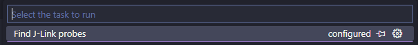

You should get an output similar to the following:

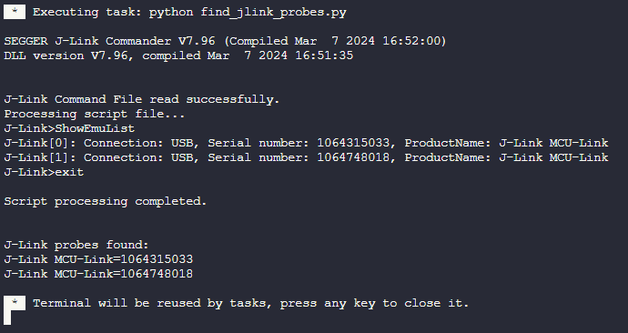

### What's under the hood

This task will run the python script `.vscode/configs/find_jlink_probes.py`. This script will find the J-Link probes connected
to the machine by running the `ShowEmuList` command in J-Link Commander. It will then store those information in the
`.vscode/configs/jlink_setup.cfg` file in the format `NAME:serial number`. If you wish to customize this file, to change
the probes names for example, you can edit manually the file, but keep in mind running the script again will overwrite your
changes. You can run this task anytime your setup evolves, for example if unplug/plug a board.

>Note1:The `jlink_setup.cfg` file is local to your environment and ignored by Git.

## Debug

NXP provides several launch configuration integrated with the CMake Tools and Cortex-Debug extensions.
You can get the list of the available launch configurations from the `Run and Debug` tab from the Activity Bar.

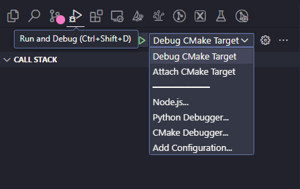

When starting a debugging session using one of NXP provided launch configuration, you will be asked to select an NXP
platform:

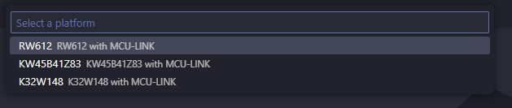

The information contained in `Jlink_setup.cfg` will be used by the launch configurations to allow you to dynamically select
the physical platform you want to flash and debug your application:

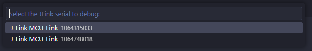

Then, the debugging sessions will start after the application is flashed/attached to the target:

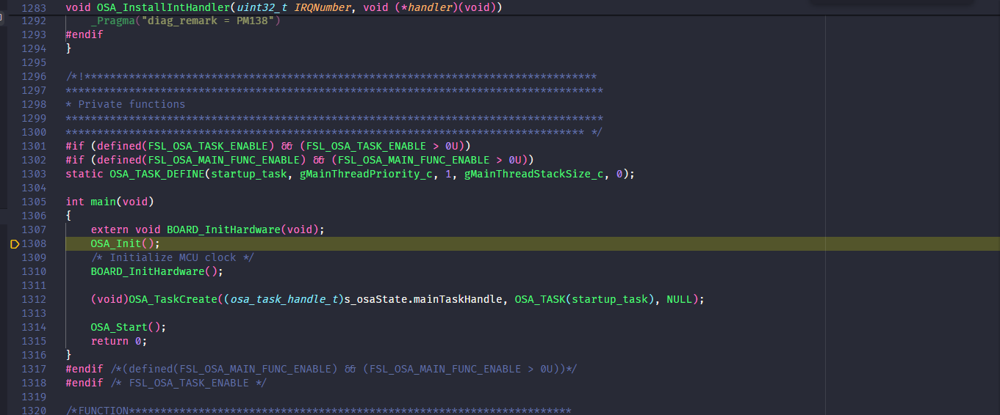

If you installed all recommended extensions, you will get access to a better debugging experience:
- RTOS views

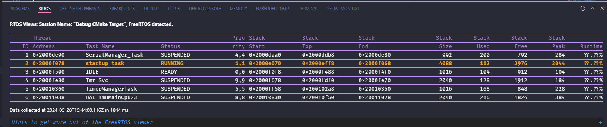

- Memory views

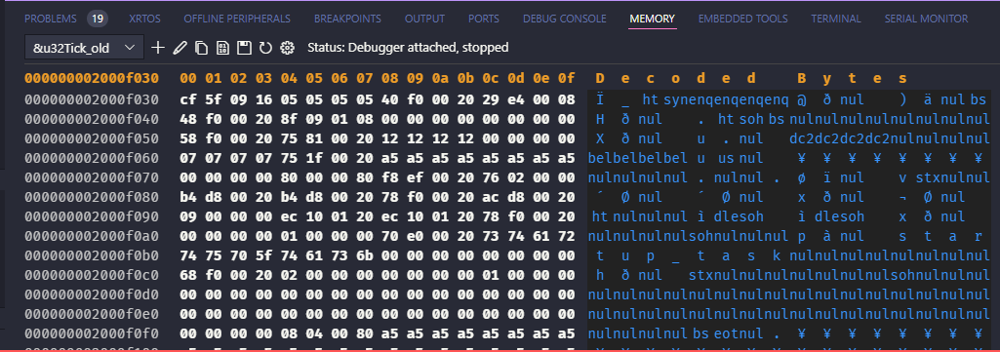

- Serial interface

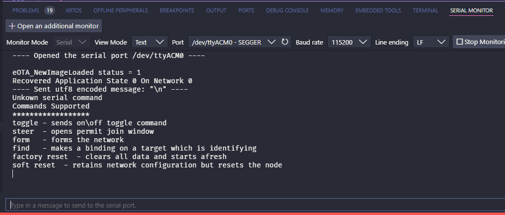

and more...

### What's under the hood

When starting a debugging session using the NXP provided launch configuration, the `command-variable` extension will be used
to gather several information.

First, it will parse the `.vscode/configs/platform.json` file to get the list of supported platforms and let you choose one
of them. Your choice will help determine which information to give to Cortex Debug, related to the target to debug:
- the debugging interface (SWD/JTAG)
- the debug interface speed
- the J-Link target name
- the SVD file to load

Then, it will parse the `.vscode/configs/jlink_setup.cfg` file to get the list of target physically connected to your machine.
It will let you choose which one of them you want to flash and debug.

All of this can be customized or extended by the user, but NXP's goal is to provide a generic, easy, close to native way
of debugging with VS Code.
