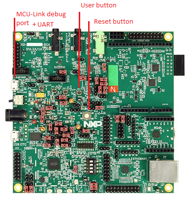

# Table of content

- [Table of content](#table-of-content)
- [Overview](#overview)
- [Software requirements](#software-requirements)
- [Hardware requirements](#hardware-requirements)
  - [RD-RW612-BGA](#rd-rw612-bga)
- [Examples](#examples)
  - [Loading the examples](#loading-the-examples)

# Overview

This document provides information specific to the
[RW612](https://www.nxp.com/products/wireless-connectivity/wi-fi-plus-bluetooth-plus-802-15-4/wireless-mcu-with-integrated-tri-radio-1x1-wi-fi-6-plus-bluetooth-low-energy-5-4-802-15-4:RW612)
platform. It will provide software and hardware requirements and supported features.

# Software requirements

The RW612 platform is only supported in the CMake build system provided in the zigbee repo. For more details on how to
use and build the examples for this platform using CMake, refer to the top level [README.md](../../../README.md).

The latest MCUXPresso GitHub SDK version supported for this platform is [TODO]()

To flash the demo examples executables, you'll need [J-Link](https://www.segger.com/downloads/jlink).

# Hardware requirements

Currently, the Zigbee examples on RW612 are supported on the following boards:
- RD-RW612-BGA

## RD-RW612-BGA



# Examples

Here are a list of the examples supported on RW612 platform:
- [Coordinator](../../../examples/zigbee_coordinator/README.md)
- [Router](../../../examples/zigbee_router/README.md)

## Loading the examples

1. Plug the RD-RW612-BGA board to the USB port (use the MCU-Link port on the board)
2. Run the following command:
```bash
JLinkExe -device RW612 -if SWD -speed 4000 -autoconnect 1
```
3. J-Link should connect to your target
4. Enter the following J-Link commands to load the executable
```bash
reset
halt
loadfile <path to your .elf file>
reset
go
exit
```

According to the example you want to run, open a serial interpreter on the correct COM/tty port to see the logs from
the application.
